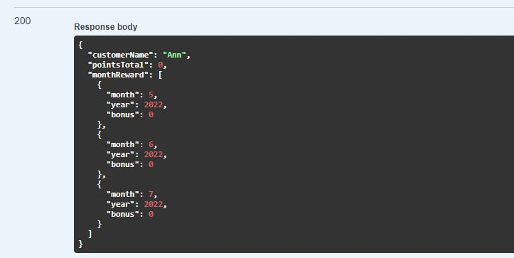
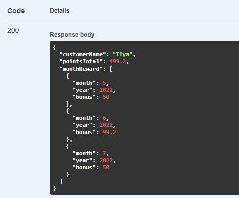
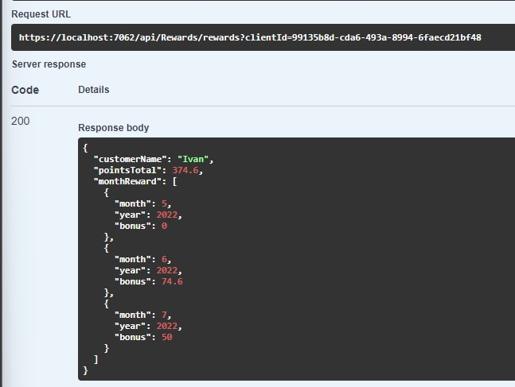
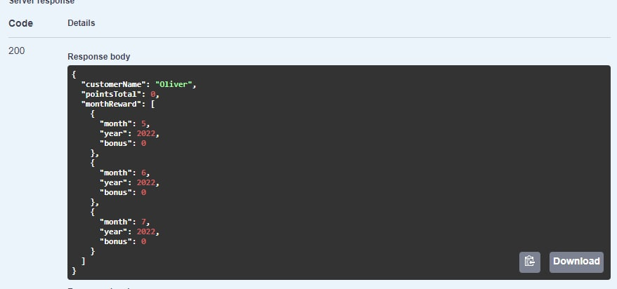
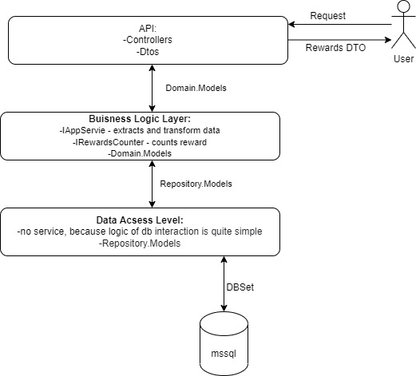

# Rewards counter

#### This is application for counting rewards according to money where spent.

## Table of contents

* [Installation and start](#installation-and-starting)
* [API](#api)
* [Test](#tests)
  * [Test datasets](#test-datasets)
    * [Clients table](#clients)
    * [Transactions table](#transactions)
    * [Transactions per last three mounth](#transactions-per-last-three-mounthpartially)
    * [Transactions per last mounth](#transactions-per-mounthspartially)
    * [Server responce](#real-server-responce)
  * [Unit tests startup](#unit-tests)
* [Technology stack](#technology-stack)
* [Architecture](#architecture)
    
## API

* health route: .../api/health, it validates also and db connection
* task endpoint is: ...api/rewards?user_id
* more about api in .../swagger/index.html

## Installation and starting

#### all settings in file appsettings.Development.json
#### db username and passwords in ClientSecrets storage

### Without Docker

1. Download this repository.
2. Check out connection to props in RewardsCounter.Api/appsettings.Developer.json.
3. Open in cmd RewardsCounter.Api folder
4. run in cmd:  
>dotnet run

### With Docker

1. Open repo and run:
> docker-composer build

> docker-composer run

2. Rerun app container if smth went wrong.

## Tests

## Test datasets
### Clients

|Id                                  |Name  | Date Registered |
|------------------------------------|------|-----------------|
|3b217a1d-c7d9-40da-a4d4-14e4c3a2ae2b|Ann   | 2020-07-28      |
|ee884543-1b4e-46f9-a652-575aa9570f01|Olivia| 2018-03-01      |
|99135b8d-cda6-493a-8994-6faecd21bf48|Ivan  | 2020-07-28      |
|fa05b53c-da5e-4a30-9751-744afdcc5198|Oliver| 2022-01-28      |
|7203c9dd-6778-435e-8788-ce3532393fd0|Emma  | 2021-07-28      |
|b96c7e78-46bd-4057-8990-e3d2f82e0e8b|Ilya  | 2018-07-28      |
|b5280851-7383-49d0-8375-e98f84e1ce3b|Amelia| 2022-07-05      |
|de632b7e-627d-4bfe-9f96-edc290d32bbe|John  | 2019-03-12      |
|002f9c00-7523-44f1-ab9e-f906f368ab17|Liam  | 2018-02-13      |

### Transactions
|Id                                  |Timestamp |Sum   |Client|
|------------------------------------|----------|------|------|
|c2c976ae-e01a-4c7d-a0e8-00adadf3a768|2022-06-25|12.30 |John|
|043fbb79-3560-4513-873d-1d2add5da8b4|2022-05-22|100.00|Ilya|
|26d3b846-b2da-4868-87d1-23ed689d5be1|2022-06-25|12.30 |Ivan|
|929fc6e8-223f-4d09-9e79-34a079f69a03|2022-05-22|50.00 |John|
|520ab412-3b2e-4db5-9c52-3bdda7abcb19|2022-06-25|12.30 |Oliver|
|6130c7f5-9cd2-4c3b-9e2b-455f38effff7|2022-06-25|120.00|Liam|
|362762c5-a5b0-422b-bc16-45d7ecfe4e8b|2022-06-22|100.00|Ilya|
|c87e3ce6-61e7-454e-90d6-45e6143ed917|2022-07-22|100.00|John|
|81089cf3-1eeb-4477-afe6-4f7141854a56|2022-06-25|12.30 |Ilya|
|3e4a82ef-8d95-4d46-b8c5-52a767513386|2022-06-22|100.00|Ivan|
|71e8c012-2e1c-4ab5-b4dd-53d7bbf1d1f0|2022-07-22|100.00|Ivan|
|dfde73ed-180d-45ae-9ff6-66a7dd39de70|2022-06-25|12.30 |Ilya|
|e5d17ba3-55a8-4a27-8881-97684409b31f|2022-07-22|100.00|Ilya|
|c4574704-626d-49bf-bc2f-9877331f1c2a|2022-05-22|50.00 |Emma|
|78c32232-07fc-4fc4-ade8-d95c9de211f2|2022-06-25|12.30 |Amelia|
|83931490-dda8-4abd-801d-de5db8bfbff6|2022-06-25|12.30 |John|
|dfa89f9b-47a4-4b33-8c8a-e8ec41a170d6|2022-05-22|50.00 |Ivan|

### Transactions per last three mounth(partially)
| Name     | Sum   | Bonus  |
|----------|-------|--------|
| Ann      | 0     | 0      |
| Ilya     | 324.6 | 499.2  |
| Ivan     | 262.3 | 299.2  |
| Oliver   | 12.3  | 0      |

### Transactions per mounths(partially)

| Name     | May | June     | July |
|----------|-----|----------|------|
| Ann      | 0   | 0        | 0    |
| Ilya     | 50  | 99.2     | 50   |
| Ivan     | 0   | 74.6     | 50   |
| Oliver   | 0   | 0        | 0    |

### Real Server Responce
Ann:

Ilya:

Ivan:

Oliver:

## Unit tests

1. Open RewardsCounter.Tests
2. Run 
> dotnet test

## Technology stack
* Asp .net core 6
* MSSQL
* Docker
* Docker-compose

## Architecture

